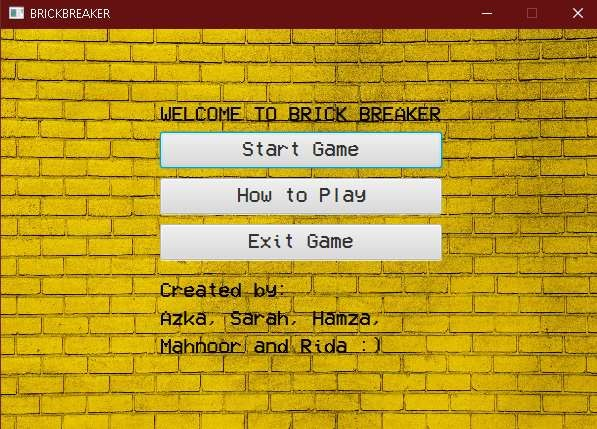
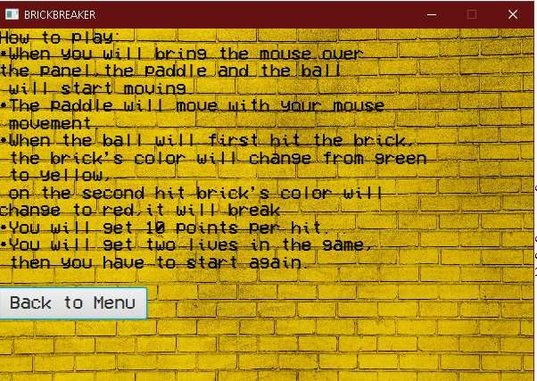
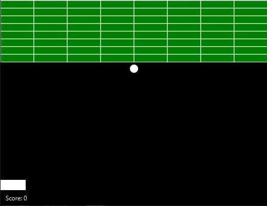
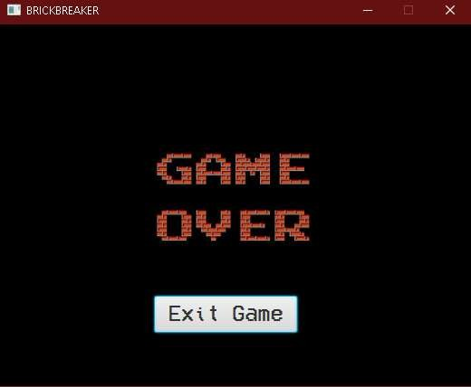

> **Output:**

# Menu

{width="5.5884601924759405in"
height="4.021874453193351in"}

> First scene of game is the menu displayed with background music.

# How to play

> On Clicking "How To Play", instructions are displayed to play the
> game. Clicking "Back to Menu" will display menu again.
>
> {width="5.386017060367454in"
> height="3.825207786526684in"}

# Start Game

{width="5.283928258967629in"
height="3.35in"}

> On clicking "Start Game", BrickBreaker game will start. User will have
> 2 lives to play the
>
> game. Game will not start until mouse will hover over paddle.

# life lost

{width="4.820805993000875in"
height="3.1171872265966756in"}

> When user loses 1 life lost, Game will start again. Ball will be on
> starting position and it will not start until user mouse move over
> paddle.

# You Win

> On breaking all the bricks, a scene of "You Win" will be displayed
> with sound effects.

# You Lose

{width="4.119339457567804in"
height="3.388333333333333in"}

> When user loses both of his lives, a scene of Game Over will be
> displayed with sound effects.

## Flow Chart:

### menu start game lose win

> how to play

### Exit
